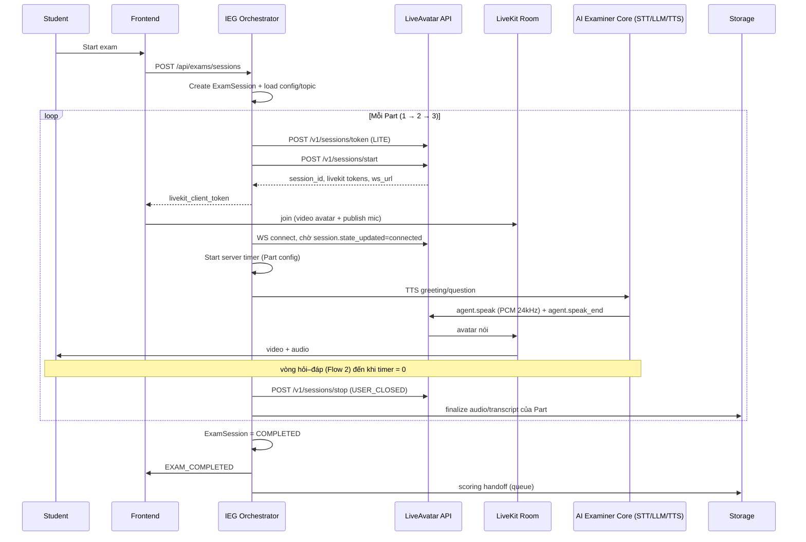
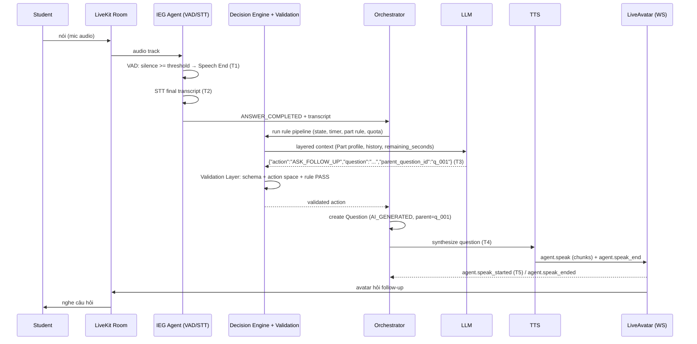
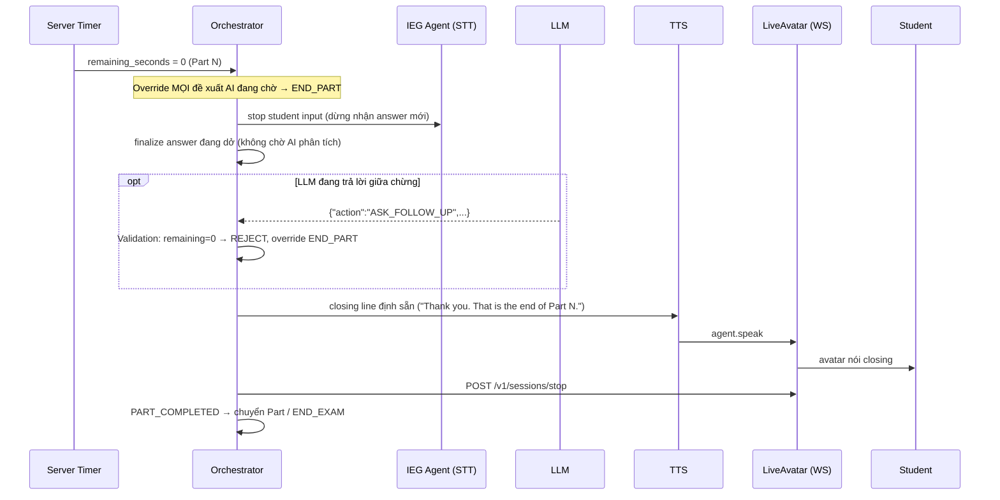
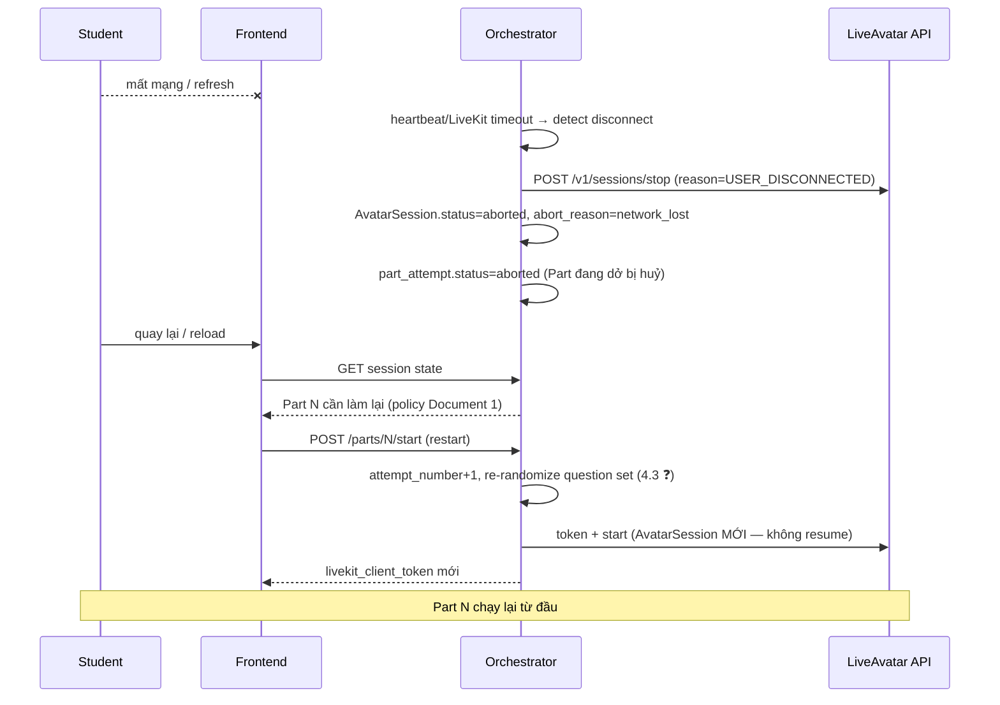

# Realtime Examiner — Technical Integration Specification

**Document 2** · Đối tượng đọc: Backend Developer, Frontend Developer, AI Engineer, QA, DevOps
**Phiên bản:** v1.1 · **Ngày:** 2026-08-25
**Trạng thái:** Draft — **đã đồng bộ với Document 1 Rev 5** (Product & Functional Requirements, 2026-08-24)

> **Đồng bộ Document 1 (Rev 5):** tài liệu này tuân theo các quyết định Stakeholder đã chốt: (1) đây là **mock test** — anti-cheat/proctoring Out of Scope; (2) HeyGen chỉ là lớp Avatar/Streaming, toàn bộ dữ liệu bài thi lưu tại IEG; (3) **restart Part** khi refresh/mất mạng là ✅ Core Business Rule; (4) số câu hỏi: Part 1: 6–10, Part 2: 1 cue card, Part 3: 4–6 theo topic Part 2; (5) scoring ở hệ thống IEG khác — chỉ handoff dữ liệu; (6) cơ chế câu hỏi **Hybrid** (IEG cung cấp câu gốc/cue card/seed, AI chỉ generate follow-up). Các ❓ trong tài liệu này map với Open Questions P0/P1/P2 của Document 1 mục 18.

**Quy ước ký hiệu trong tài liệu:**
- ✅ **Confirmed** — requirement đã xác nhận (từ Document 1 / Stakeholder chốt)
- 🔷 **Assumption** — giả định hợp lý, cần xác nhận lại
- 💡 **Recommendation** — đề xuất của kiến trúc sư
- ❓ **Open Question / Need Confirmation** — chưa chốt, phải quyết trước khi implement
- 📗 **Verified** — đã xác minh trực tiếp trên tài liệu chính thức docs.liveavatar.com (ngày 2026-08-25)

---

## 0. Executive Summary

Realtime Examiner cho phép học viên thi (mock test ✅) IELTS Speaking bằng hội thoại realtime với AI Examiner hiển thị dưới dạng avatar (HeyGen LiveAvatar, **LITE mode** — khuyến nghị mạnh của Document 1 mục 1.4b; xác nhận cuối là Open Question #26/P0). Toàn bộ "bộ não" bài thi — Exam State Machine, server-side timer, Conversation Decision Engine theo từng Part, STT/LLM/TTS — nằm trong hệ thống IEG; LiveAvatar chỉ render/stream video avatar qua WebRTC (LiveKit).

Kiến trúc tuân thủ nguyên tắc: **LLM → Structured Output → Validation Layer → Exam Orchestrator → State Machine**. LLM chỉ đề xuất action; Orchestrator là component duy nhất có quyền ghi Exam State và là source of truth cho Part, timer, completion status.

**Mức độ sẵn sàng:** PARTIALLY READY — kiến trúc và API LiveAvatar đã đủ rõ để bắt đầu thiết kế chi tiết; còn thiếu quyết định về STT/TTS provider, pricing gói LiveAvatar, và một số business rule.

**Top rủi ro / Open Question kỹ thuật:**
1. LiveAvatar LITE mode có idle timeout 5 phút — cần keep-alive; Part 2 preparation time có nguy cơ chạm timeout nếu không gửi keep-alive.
2. LiveAvatar có endpoint transcript theo session — cần xác nhận data retention/DPA phía HeyGen (mục 14).
3. STT provider & VAD/endpointing strategy chưa chốt — ảnh hưởng trực tiếp latency và quyết định ANSWER_COMPLETED.
4. Preparation time Part 2 có tính vào 3 phút hay không — ❓ P0 (#21, Document 1).
5. Restart Part: re-randomize question set + giới hạn số lần restart — ❓ P0 (#24, Document 1); chính sách restart bản thân nó đã ✅ Confirmed.

---

## 1. System Architecture

### 1.1 Sơ đồ tổng quan

```
                        IEG SYSTEM (source of truth cho mọi logic bài thi)
┌────────────────────────────────────────────────────────────────────┐
│  Exam Frontend (Web)                                               │
│   │  (REST + WebSocket tới IEG; WebRTC/LiveKit tới LiveAvatar)     │
│   ▼                                                                │
│  Exam Session API (REST)                                           │
│   ▼                                                                │
│  Realtime Examiner Orchestrator  ◄── DUY NHẤT có quyền ghi State   │
│   ├── Topic / Question Service (IEG config)                        │
│   ├── Conversation Decision Engine (per-Part profile)              │
│   ├── Validation Layer (kiểm tra structured output của LLM)        │
│   ├── Exam State Machine + Server-side Timer                       │
│   ▼                                                                │
│  AI Examiner Core                                                  │
│   ├── STT Service (VAD/endpointing thuộc IEG)                      │
│   ├── LLM / AI Agent (chỉ đề xuất action, không ghi state)         │
│   └── TTS Service (sinh audio PCM cho avatar nói)                  │
│   │                                                                │
│   ├── Audio Storage (S3-compatible, IEG)                           │
│   └── Scoring Handoff (→ hệ thống scoring IEG)                     │
└──────────────┬─────────────────────────────────────────────────────┘
               │  agent.speak (audio PCM 24kHz, Base64) qua WebSocket
               ▼
      LiveAvatar (LITE Mode) — chỉ render + stream avatar video
               ▼  WebRTC (LiveKit room)
        Avatar Video Stream ──► Student (browser)
        Student mic audio ──► LiveKit room ──► IEG Agent (STT)
```

### 1.2 Responsibility từng component

| Component | Trách nhiệm | Được ghi gì |
|---|---|---|
| **Exam Frontend** | Render UI thi, hiển thị timer (đọc từ server), join LiveKit room, publish mic audio | Không ghi state nghiệp vụ |
| **Exam Session API** | CRUD Exam Session, expose config/topic, nhận kết quả | Ghi qua Orchestrator |
| **Exam Orchestrator** | **Nơi duy nhất ghi Exam State**; điều phối toàn bộ luồng thi; giữ server-side timer; quyết định Part transition, end exam; override đề xuất LLM | Exam State, timer, Part, question status |
| **Topic/Question Service** | Cung cấp topic/static question/cue card từ pool do IEG quản lý | Question pool (admin) |
| **Conversation Decision Engine** | Chạy rule pipeline (mục 3.2), gọi LLM, áp Part profile | Chỉ đề xuất — không ghi state |
| **Validation Layer** | Validate structured output của LLM: schema, action space, vi phạm rule | Không ghi state; trả verdict cho Orchestrator |
| **STT Service** | Speech→text; partial + final transcript; VAD/silence detection | Transcript record (qua Backend) |
| **LLM / AI Agent** | Sinh câu hỏi/follow-up dưới dạng structured JSON | Không ghi gì trực tiếp |
| **TTS Service** | Text→audio (PCM 16-bit 24kHz) để gửi cho LiveAvatar | Không ghi state |
| **Audio Storage** | Lưu audio câu trả lời + toàn phiên; signed URL | Audio object |
| **LiveAvatar (LITE)** | Nhận audio đã TTS xong qua WebSocket `agent.speak`, render avatar, stream video qua LiveKit | Không tham gia quyết định nghiệp vụ |

### 1.3 Ranh giới quan trọng

- **Exam Orchestrator là nơi duy nhất có quyền ghi (write) vào Exam State.** Mọi component khác chỉ đọc hoặc đề xuất. LLM đề xuất qua structured output; Frontend chỉ hiển thị.
- **LiveAvatar không quyết định turn-taking.** 📗 Verified: ở LITE mode, LiveAvatar "focuses exclusively on real-time video generation driven by your audio input. You handle the conversational orchestration — STT, LLM, TTS". IEG gửi lệnh `agent.speak` (audio) / `agent.start_listening` / `agent.interrupt` qua WebSocket; LiveAvatar chỉ thực thi render.
- **Audio của Student đi qua LiveKit room (hạ tầng do LiveAvatar tạo, hoặc LiveKit của IEG — xem 7.3), nhưng quyết định ANSWER_COMPLETED thuộc IEG.** IEG Agent subscribe audio track của Student từ room, chạy VAD/endpointing + STT. "Truyền tải tín hiệu" (transport) ≠ "ra quyết định nghiệp vụ" (business decision): LiveKit/LiveAvatar chỉ là transport.
- 💡 **Recommendation:** dùng `livekit_config` (bring-your-own LiveKit) nếu IEG muốn kiểm soát hoàn toàn media plane và recording server-side (LiveKit Egress); nếu không, dùng LiveKit room do LiveAvatar tạo (mặc định) và record audio ở agent. Xem Option A/B tại mục 11.

---

## 2. End-to-End Data Flow

Từ Start Exam đến Exam Completed:

1. **Create session** — Frontend gọi `POST /api/exams/sessions` → Orchestrator tạo ExamSession (status `INITIALIZING`), sinh `session_id`.
2. **Load config** — Orchestrator gọi Topic/Question Service: Part config (mục 4.1), topic + static question set cho Part 1; ghi `question_set_version` dùng cho attempt này.
3. **Init LiveAvatar** — Backend gọi `POST /v1/sessions/token` (mode `LITE`, `avatar_id`) → nhận session token; gọi `POST /v1/sessions/start` (Bearer token) → nhận `session_id` (avatar), `livekit_url`, `livekit_client_token`, `livekit_agent_token`, `ws_url`. 📗 Verified. Lưu AvatarSession record (mục 10).
4. **Establish realtime connection** — Frontend join LiveKit room bằng `livekit_client_token` (nhận video avatar, publish mic). IEG Agent join bằng `livekit_agent_token` (subscribe mic của Student). Backend mở WebSocket tới `ws_url`, chờ `session.state_updated = "connected"`. 📗 Verified.
5. **Start timer** — Orchestrator start server-side timer cho Part 1 (`duration_seconds` từ config). Client chỉ hiển thị remaining time do server đẩy xuống.
6. **Greeting** — Orchestrator lấy greeting script → TTS → gửi `agent.speak` (audio PCM 24kHz Base64, chunk ~1s) + `agent.speak_end` → avatar chào Student.
7. **Question** — Orchestrator lấy static question đầu tiên → TTS → `agent.speak`. Question status: `QUESTION_PRESENTED`. Sau `agent.speak_ended`, gửi `agent.start_listening`.
8. **Student speech** — Student nói; audio publish lên LiveKit room.
9. **Audio streaming → STT** — IEG Agent nhận audio, chạy VAD; stream vào STT (partial transcript realtime). Silence threshold vượt ngưỡng (per-Part config) → STT final → `ANSWER_COMPLETED` (do IEG quyết).
10. **AI reasoning** — Conversation Decision Engine chạy rule pipeline (mục 3.2) → gọi LLM với layered context (mục 8.2) → structured output → Validation Layer → Orchestrator quyết action.
11. **Next question generation** — Nếu action là ASK_FOLLOW_UP/ASK_NEXT_QUESTION: tạo Question record (follow-up có `parent_question_id`).
12. **TTS → avatar response** — Text câu hỏi → TTS → `agent.speak` → avatar nói. Lặp lại 8–12.
13. **Part transition** — Server timer = 0 hoặc Orchestrator quyết END_PART → finalize answer đang dở, đóng AvatarSession (💡 nếu dùng chiến lược 1 AvatarSession/Part — xem 7.3), chuyển Part, load config + question set của Part kế, tạo AvatarSession mới.
14. **Completion** — Hết Part 3 → Orchestrator set ExamSession = `COMPLETED`, gọi `POST /v1/sessions/stop` (reason `USER_CLOSED`). 📗 Verified.
15. **Audio/transcript finalization** — Upload audio còn lại, chốt transcript chính thức (từ STT của IEG), ghi metadata (part, sequence, timestamps).
16. **Scoring handoff** — Đẩy payload (session_id, câu hỏi, transcript, audio URL, part, thứ tự, timestamps) sang hệ thống scoring của IEG (async, qua queue). ✅ **Scoring tự thân Out of Scope** (Document 1 #9): Realtime Examiner chỉ lưu + bàn giao đầy đủ dữ liệu; định dạng/trigger interface ❓ #25/P0 chốt với team scoring.

---

## 3. Conversation Decision Engine

Phần lõi của hệ thống: cách AI Agent quyết định hành động tiếp theo — và cách server kiểm soát quyết định đó.

### 3.1 Action Space

LLM chỉ được đề xuất **một** trong các action sau (enum đóng — output ngoài danh sách bị Validation Layer reject):

| Action | Ý nghĩa | Quyền quyết định cuối |
|---|---|---|
| `ASK_INITIAL_QUESTION` | Hỏi câu hỏi gốc đầu tiên của topic | Orchestrator |
| `ASK_FOLLOW_UP` | Hỏi follow-up đào sâu câu trả lời vừa rồi | Orchestrator (check quota) |
| `ASK_NEXT_QUESTION` | Chuyển sang static question kế tiếp | Orchestrator |
| `MOVE_TO_NEXT_PART` | *Chỉ là đề xuất* | **Orchestrator quyết định thật** |
| `END_PART` | *Chỉ là đề xuất* | **Orchestrator quyết định thật** |
| `END_EXAM` | *Chỉ là đề xuất* | **Orchestrator quyết định thật** |
| `RETRY` | Yêu cầu Student nhắc lại (không nghe rõ/transcript rỗng) | Orchestrator (giới hạn số lần) |
| `FALLBACK` | Dùng câu thoại fallback định sẵn khi LLM không chắc chắn | Orchestrator |

### 3.2 Rule Priority Pipeline

Thứ tự đánh giá — trước khi gọi AI và sau khi AI trả về:

| # | Bước | Input | Output | Component chịu trách nhiệm | Nếu fail |
|---|---|---|---|---|---|
| 1 | Check exam/session state | `session_id` | State hợp lệ? (COMPLETED/FAILED → dừng) | Orchestrator | Trả lỗi 409 cho caller, log anomaly, không xử lý tiếp |
| 2 | Check remaining time (server-side) | Server timer | `remaining_seconds`; nếu = 0 → **override mọi đề xuất AI** thành END_PART/END_EXAM | Orchestrator (timer) | Timer service lỗi → fail-safe: coi như hết giờ, END_PART, log CRITICAL |
| 3 | Check current Part + Part rule | Part config (4.1) | Rule set áp dụng (VD Part 2: không ngắt Student) | Decision Engine | Config thiếu → dùng default config version gần nhất, log WARN |
| 4 | Check current question completed chưa | Question status | Nếu `STUDENT_ANSWERING` → không sinh câu mới | Decision Engine | Status không nhất quán → reconcile theo DB, log anomaly |
| 5 | Check IELTS conversation rule | History + config | Giữ topic; follow-up depth ≤ `max_follow_up` | Decision Engine | — (rule thuần logic) |
| 6 | Gọi LLM | Layered context (8.2) | Structured output (8.1) | AI Agent | Timeout/error → retry 1 lần → FALLBACK (mục 15) |
| 7 | Validation Layer | LLM output | PASS / FAIL(+lý do) — đúng schema? đúng action space? vi phạm rule 1–5? | Validation Layer | FAIL → Orchestrator override bằng action an toàn (bảng 3.3), log `llm_output_rejected` |
| 8 | Thực thi action | Action đã validate | State transition + lệnh TTS/avatar | **Orchestrator** (duy nhất) | Thực thi lỗi → retry idempotent; nếu vẫn lỗi → error handling mục 15 |

Bước 1–5 chạy **trước** khi gọi LLM (tiết kiệm token + latency: nếu hết giờ thì không cần gọi LLM). Bước 7 chạy **sau** khi LLM trả về, kiểm lại toàn bộ rule vì trạng thái có thể đã thay đổi trong lúc LLM suy nghĩ (VD: hết giờ giữa chừng).

### 3.3 Override Scenarios

| LLM đề xuất | Điều kiện server-side | Orchestrator thực thi |
|---|---|---|
| `ASK_FOLLOW_UP` | `remaining_seconds = 0` | `END_PART` |
| `ASK_FOLLOW_UP` | Đã đạt `max_follow_up` của Part | `ASK_NEXT_QUESTION` hoặc `END_PART` (nếu hết static question) |
| `ASK_FOLLOW_UP` | Part 2 (`max_follow_up = 0`) | `ASK_NEXT_QUESTION`/`END_PART`; log anomaly (prompt lỗi) |
| `MOVE_TO_NEXT_PART` | Part hiện tại chưa đạt `min_duration_before_part_transition_seconds` | Reject, tiếp tục Part hiện tại |
| `END_EXAM` | Chưa hoàn thành đủ 3 Part | Reject, log anomaly |
| `ASK_NEXT_QUESTION` | Hết static question trong set và `remaining_seconds > 0` | `ASK_FOLLOW_UP` (nếu còn quota) hoặc `END_PART` |
| Bất kỳ action hỏi tiếp | Student đang nói (Part 2, `allow_interrupt_student = false`) | Hoãn — chờ ANSWER_COMPLETED hoặc timer = 0 |
| `RETRY` | Đã RETRY ≥ 2 lần cho cùng question | `ASK_NEXT_QUESTION` (đánh dấu answer là `NO_RESPONSE`) |
| Output sai schema / action ngoài enum | — | `FALLBACK` (câu thoại trung tính định sẵn) hoặc lặp static script; log `llm_output_rejected` |
| Question text chứa nội dung vi phạm (feedback/score/PII) | Content filter fail | `FALLBACK`; log CRITICAL |

---

## 4. Part-specific Examiner Engine

Ba Part dùng chung Conversation Decision Engine (mục 3) nhưng với **Examiner Behavior Profile** riêng: Interview Engine (Part 1), Long Turn Engine (Part 2), Discussion Engine (Part 3). Profile = config object + prompt template riêng (Layer 2, mục 8.2). ✅ **Cơ chế câu hỏi Hybrid (Document 1 #4, mục 4.4):** IEG cung cấp 100% câu gốc/cue card/seed question (AI không bao giờ tự chọn topic — xác nhận lại ❓ #6/P0); AI chỉ generate follow-up bám theo câu trả lời (Part 1/3) và tối đa 1 rounding-off question Part 2 (❓ #2).

### 4.1 Part Configuration Schema

Config lưu ở Backend, do IEG quản lý qua admin — **không hard-code**. IEG đổi format bài thi (thời lượng, max follow-up…) mà không cần sửa code. Có `config_version` để audit.

```json
{
  "part": 1,
  "duration_seconds": 180,
  "question_mode": "STATIC_WITH_DYNAMIC_FOLLOW_UP",
  "max_follow_up": 2,
  "allow_interrupt_student": true,
  "preparation_time_seconds": 0,
  "preparation_time_included_in_duration": null,
  "allow_skip": false,
  "min_duration_before_part_transition_seconds": null,
  "silence_end_of_answer_ms": 1500,
  "max_answer_seconds_per_question": 45,
  "max_retry_per_question": 2,
  "config_version": "2026-08-25.1"
}
```

```json
{
  "part": 2,
  "duration_seconds": 180,
  "question_mode": "STATIC_CUE_CARD",
  "max_follow_up": 0,
  "allow_interrupt_student": false,
  "preparation_time_seconds": 60,
  "preparation_time_included_in_duration": null,
  "allow_skip": false,
  "min_duration_before_part_transition_seconds": 120,
  "silence_end_of_answer_ms": 4000,
  "max_answer_seconds_per_question": 180,
  "max_retry_per_question": 0,
  "config_version": "2026-08-25.1"
}
```

```json
{
  "part": 3,
  "duration_seconds": 180,
  "question_mode": "STATIC_WITH_DYNAMIC_FOLLOW_UP",
  "max_follow_up": 3,
  "allow_interrupt_student": true,
  "preparation_time_seconds": 0,
  "preparation_time_included_in_duration": null,
  "allow_skip": false,
  "min_duration_before_part_transition_seconds": null,
  "silence_end_of_answer_ms": 2000,
  "max_answer_seconds_per_question": 60,
  "max_retry_per_question": 2,
  "config_version": "2026-08-25.1"
}
```

**Giá trị đã chốt theo Document 1:** số câu hỏi ✅ `question_count`: Part 1: 6–10 (IEG cấu hình theo topic set), Part 2: 1 cue card, Part 3: 4–6 seed question theo topic Part 2 → thêm field `question_count_min`/`question_count_max` vào schema. Follow-up theo Document 1 💡 (❓ Configurable): Part 1 tối đa **1** follow-up/câu gốc, Part 3 tối đa **2** (giá trị 2/3 ở JSON trên điều chỉnh lại thành 1/2 khi implement default). Part 2: `max_follow_up = 0` cho long turn nhưng cho phép **1 rounding-off question** sau khi Student nói xong (❓ #2/P0 — liên quan cho kết thúc Part sớm) → thêm field `allow_rounding_off_question`. Part 3 seed question bắt buộc liên kết topic của cue card Part 2 ✅ → Question Service nhận `part2_topic_id` khi load set Part 3.

🔷 Field bổ sung so với đề bài (lý do): `silence_end_of_answer_ms` (ngưỡng VAD kết thúc câu trả lời khác nhau theo Part — Part 2 cần ngưỡng dài hơn vì Student được phép ngừng nghĩ giữa monologue), `max_answer_seconds_per_question` (chặn 1 câu trả lời chiếm toàn bộ Part 1/3), `max_retry_per_question`, `config_version`. `preparation_time_included_in_duration = null` vì ❓ chưa chốt (xem 4.2). Các giá trị số ở trên là 🔷 đề xuất mặc định — cần IEG confirm.

### 4.2 Part 2 — Long Turn: xử lý đặc biệt

```
Examiner introduces task ("I'm going to give you a topic...")
      ↓
Present cue card / topic  (hiển thị text trên UI + avatar đọc)
      ↓
Preparation time — timer riêng (preparation_time_seconds)
  · Avatar chuyển pose listening/idle (agent.start_listening)
  · Backend gửi session.keep_alive định kỳ (idle timeout 5 phút 📗)
  · ❓ Có tính vào 180s của Part hay là cộng thêm — Need Confirmation
      ↓
"You can start speaking now" → Student long turn (monologue)
  · Examiner KHÔNG ngắt (allow_interrupt_student = false)
  · STT chạy streaming; silence ngắn KHÔNG kết thúc answer
    (silence_end_of_answer_ms = 4000, và chỉ finalize sớm nếu Student
     im lặng dài + đã nói tối thiểu N giây — 🔷 cần tune)
      ↓
Server timer 180s = 0 → Orchestrator FINALIZE ngay:
  · Cắt input Student (dừng thu nhận STT cho answer này)
  · KHÔNG chờ AI phân tích xong mới cắt — finalize là quyết định
    của timer, không phụ thuộc LLM
  · Avatar nói closing line định sẵn ("Thank you.") → END_PART
```

❓ **Open Question:** preparation time có tính vào 3 phút của Part hay là thời gian cộng thêm — chưa xác định; schema đã có field `preparation_time_included_in_duration` để không phải sửa code khi chốt.

### 4.3 Restart Part — Question Set Policy

✅ **Confirmed — Core Business Rule (Document 1 mục 7.1b, Stakeholder chốt):** refresh/mất mạng → làm lại **toàn bộ Part đang dở** (timer 3 phút mới); các Part đã hoàn thành giữ nguyên; **không có resume giữa chừng Part**. Dữ liệu attempt dở vẫn lưu kèm cờ `aborted attempt` để audit, **không dùng cho scoring** (💡 Document 1). Giới hạn số lần restart/session: ❓ #24/P0 (mỗi restart tốn thêm phút LiveAvatar — theo dõi metric "avg LiveAvatar minutes per completed exam", mục 16–17).

Quyết định kỹ thuật: khi restart một Part, dùng lại đúng bộ câu hỏi cũ hay đổi bộ khác?

**Rủi ro nếu dùng lại y nguyên:** học viên có thể cố tình refresh/ngắt mạng để "nghe lại đề" hoặc có thêm thời gian suy nghĩ — đặc biệt nghiêm trọng với Part 2 (cue card) vì học viên biết trước đề.

💡 **Recommendation (trùng khuyến nghị mạnh của Document 1 7.1b-b):** khi restart một Part, hệ thống **re-randomize** bộ câu hỏi/cue card từ pool của IEG cho Part đó — trừ khi IEG xác nhận pool quá nhỏ. ❓ **Need Confirmation #24/P0 (business rule, không chỉ technical detail)** — ảnh hưởng trực tiếp tính công bằng; đã đưa vào mục 22.

**Field hỗ trợ (đã phản ánh vào schema mục 10):** `attempt_number` (lần thử thứ mấy của Part trong session), `question_set_version` / `question_pool_seed` gắn với từng attempt — audit được học viên đã thấy đề nào ở mỗi lần restart.

---

## 5. Question Lifecycle (Technical Schema)

```
QUESTION_CREATED → QUESTION_PRESENTED → STUDENT_ANSWERING
→ ANSWER_COMPLETED → AI_ANALYZING → FOLLOW_UP / NEXT_QUESTION
→ QUESTION_COMPLETED
```

**Question entity:** `question_id`, `parent_question_id` (null nếu là câu gốc), `topic_id`, `part`, `source` (`STATIC` / `AI_GENERATED`), `sequence`, `status`, `asked_at`, `completed_at`, `answer_id` (+ `attempt_number`, `question_set_version` — mục 4.3).

**`parent_question_id`:** khi AI tạo follow-up (VD Q002 "Who do you usually go hiking with?" sinh từ Q001 "What do you usually do at weekends?"), lưu `parent_question_id = Q001` để scoring/review tái dựng được mạch hỏi-đáp logic và đo follow-up depth.

**Transition và quyền update status:**

| Transition | Trigger | Component được phép update |
|---|---|---|
| `(new) → QUESTION_CREATED` | Orchestrator chấp nhận action ASK_* (static: khi load set; AI_GENERATED: sau validation) | Orchestrator |
| `QUESTION_CREATED → QUESTION_PRESENTED` | Avatar bắt đầu đọc câu hỏi (`agent.speak_started` 📗) | Orchestrator (nhận event từ LiveAvatar WS) |
| `QUESTION_PRESENTED → STUDENT_ANSWERING` | VAD phát hiện Student bắt đầu nói | Orchestrator (input từ STT/VAD của IEG) |
| `STUDENT_ANSWERING → ANSWER_COMPLETED` | Silence ≥ `silence_end_of_answer_ms`, hoặc `max_answer_seconds` chạm, hoặc timer Part = 0 | **Orchestrator/Decision Engine (IEG)** — không phải LiveAvatar |
| `ANSWER_COMPLETED → AI_ANALYZING` | Decision Engine bắt đầu pipeline 3.2 | Orchestrator |
| `AI_ANALYZING → FOLLOW_UP/NEXT_QUESTION` | Action đã validate | Orchestrator |
| `* → QUESTION_COMPLETED` | Câu hỏi kế được present, hoặc END_PART | Orchestrator |

Không component nào ngoài Orchestrator được UPDATE status. STT/LLM chỉ cung cấp input; Frontend chỉ đọc.

---

## 6. Source of Truth Matrix

Bảng tham chiếu bắt buộc — không component nào được ghi đè dữ liệu ngoài phạm vi mình là source of truth:

| Data | Source of Truth | Ghi chú |
|---|---|---|
| Exam duration / Part config | Exam Config (Backend, quản lý bởi IEG) | Version hoá (`config_version`) |
| Current Part | Exam Orchestrator | |
| Remaining time | Server (Orchestrator) | Client chỉ hiển thị, không tính toán độc lập |
| Topic | IEG (Topic Service) | |
| Static Question / Cue card | IEG (Question Service) | |
| Follow-up Question (nội dung) | AI Agent (đề xuất) | "Có được hỏi hay không" do Orchestrator quyết |
| Exam status (state machine) | Exam Orchestrator | |
| Student transcript | STT output (IEG), persisted bởi Backend | Bản chính thức cho scoring |
| Audio file | Audio Storage Service (IEG) | |
| Score | Scoring Service | |
| Avatar video rendering | LiveAvatar (LITE mode) | Chỉ render/stream — không phải nguồn dữ liệu nghiệp vụ |
| "Answer completed" | Exam Orchestrator / Conversation Decision Engine (IEG) | VAD/silence detection do IEG xử lý; LiveAvatar chỉ là transport audio |
| Session transcript phía LiveAvatar (nếu có) | **Không phải source of truth** — chỉ tham khảo/đối soát | 📗 Endpoint `GET /v1/sessions/{session_id}/transcript` tồn tại; xác minh retention + cấu hình xoá ở mục 14 |
| Attempt history (restart) | Backend (AvatarSession + attempt_number) | Audit |
| Consent record | Backend (Compliance store) | Mục 14 |

---

## 7. API Integration

### 7.1 IEG APIs (proposal — điều chỉnh khi thiết kế chi tiết)

Tất cả API IEG: **Auth** = Bearer JWT của học viên (user-facing) hoặc service token (internal); **Owner** = IEG Backend. Error format chung: `{"error": {"code": "...", "message": "..."}}`.

| API | Method + Endpoint | Purpose | Caller | Request → Response (tóm tắt) | Retry |
|---|---|---|---|---|---|
| Create Exam Session | `POST /api/exams/sessions` | Tạo session thi | Frontend | `{"user_id","exam_id","language":"en"}` → `{"session_id","status":"INITIALIZING"}` | Idempotency-Key header; không retry mù |
| Get Exam Configuration | `GET /api/exams/{exam_id}/configuration` | Trả Part config (mục 4.1) | Backend/Orchestrator | → `{parts:[...], config_version}` | Retry + cache |
| Get Topic | `GET /api/topics/{topic_id}` | Topic + static question set | Orchestrator | → `{topic_id, part, questions:[...], version}` | Retry + cache |
| Start Part / Restart Part | `POST /api/exam-sessions/{session_id}/parts/{part}/start` | Bắt đầu/restart Part; tạo attempt + AvatarSession mới | Frontend (qua Backend) | → `{attempt_number, livekit_url, livekit_client_token, part_config}` | Idempotent theo attempt |
| Save Conversation | `POST /api/exam-sessions/{session_id}/conversation` | Lưu từng turn hội thoại | Orchestrator (internal) | `{part, speaker, question_id, text, started_at, ended_at}` | Retry with backoff (queue) |
| Save Answer | `POST /api/exam-sessions/{session_id}/answers` | Lưu answer (transcript + audio_url) | Orchestrator | `{question_id, transcript, audio_url, duration}` | Retry (queue), idempotent theo answer_id |
| Complete Exam | `POST /api/exam-sessions/{session_id}/complete` | Chốt bài thi, trigger scoring handoff | Orchestrator | → `{status:"COMPLETED"}` | Idempotent |
| Exam events (realtime) | `WSS /api/exam-sessions/{session_id}/events` | Đẩy event mục 9 + remaining_seconds xuống client | Frontend | server-push | Auto-reconnect + resume theo `last_event_id` |

### 7.2 LiveAvatar / HeyGen API

📗 **Đã xác minh trực tiếp trên docs.liveavatar.com (API reference chính thức, truy cập 2026-08-25).** Base URL: `https://api.liveavatar.com`. LiveAvatar là sản phẩm/domain riêng của HeyGen, tài liệu tách biệt với developers.heygen.com. *API có thể thay đổi — verify lại tại thời điểm implement.*

**Authentication & API key handling:**
- Server-to-server: header `X-API-KEY` (lấy từ app.liveavatar.com/developers). **Chỉ giữ ở backend/secret manager — không bao giờ đưa xuống frontend.**
- Session-scoped: `POST /v1/sessions/token` trả JWT ngắn hạn; `POST /v1/sessions/start` dùng `Authorization: Bearer <session_token>`. 📗 Session JWT không thể mint token khác — giảm blast radius nếu lộ.
- Frontend chỉ nhận `livekit_client_token` (scoped cho 1 room).

**Các API sử dụng:**

1. **Create Session Token** — `POST /v1/sessions/token`
   - Headers: `X-API-KEY`, `Content-Type: application/json`
   - Request (LITE): `{"mode": "LITE", "avatar_id": "<uuid>", "video_settings": {"quality": "high", "encoding": "H264"}, "max_session_duration": <int, seconds>, "livekit_config": {"url", "token"}?}` — `livekit_config` optional (bring-your-own LiveKit). 📗
   - Response: `{"code": 100, "data": {<session token>}, "message"}`; Error: `422` validation.
   - Purpose: cấp token khởi tạo phiên avatar cho đúng mode LITE. When: mỗi lần bắt đầu/restart một Part. Who: IEG Backend.
   - 💡 Set `max_session_duration` ≈ duration Part + preparation + buffer (VD 400s) để tự cắt chi phí nếu backend quên stop.

2. **Start Session** — `POST /v1/sessions/start`
   - Headers: `Authorization: Bearer <session_token>`
   - Request: (không body — cấu hình đã nằm trong token) 📗
   - Response `201`: `{"data": {"session_id", "livekit_url", "livekit_client_token", "livekit_agent_token", "max_session_duration", "ws_url"}}` 📗 — `ws_url` là WebSocket điều khiển avatar (LITE).
   - Purpose: khởi động avatar, tạo/join LiveKit room. When: ngay sau khi có token. Who: IEG Backend; sau đó chuyển `livekit_client_token` cho Frontend, giữ `livekit_agent_token` + `ws_url` cho IEG Agent.

3. **LITE WebSocket (realtime control)** — connect tới `ws_url` 📗
   - Command events (IEG gửi): `agent.speak` (audio **PCM 16-bit 24kHz Base64**, chunk ~1s, max 1MB/packet), `agent.speak_end`, `agent.interrupt`, `agent.start_listening`, `agent.stop_listening`, `session.keep_alive` (idle timeout **5 phút**).
   - Response events (IEG nhận): `session.state_updated` (`connecting/connected/closing/closed` — chờ `connected` trước khi gửi lệnh), `agent.speak_started`, `agent.speak_ended` (map với `event_id` của lệnh speak → dùng làm mốc AI_SPEECH_COMPLETED).
   - Error handling: reconnect WS với backoff; nếu session `closed` ngoài ý muốn → tạo AvatarSession mới (mục 15).

4. **Keep Session Alive** — `POST /v1/sessions/keep-alive`, body `{"session_id"}`, auth `X-API-KEY` hoặc Bearer 📗 (tương đương lệnh WS `session.keep_alive`). Dùng trong preparation time Part 2.

5. **Stop Session** — `POST /v1/sessions/stop`
   - Auth: `X-API-KEY` hoặc Bearer. Request: `{"session_id": "<uuid>", "reason": "USER_CLOSED"}`; reason enum 📗: `UNKNOWN, USER_DISCONNECTED, SERVER_ERROR, IDLE_TIMEOUT, NO_CREDITS, USER_CLOSED, AVATAR_DELETED, MAX_DURATION_REACHED, ZOMBIE_SESSION_REAP, AGENT_HANG_UP, DISPATCH_FAILED`.
   - When: kết thúc/abort mỗi Part. Who: IEG Backend. Map `reason` này vào `abort_reason` của AvatarSession.

6. **Get Session / List Sessions** — `GET /v1/sessions/{session_id}`, `GET /v1/sessions` 📗 — đối soát trạng thái, dọn zombie session (cron).

7. **Get Session Transcript** — `GET /v1/sessions/{session_id}/transcript` (query `start_timestamp`, `end_timestamp`) 📗
   - Response: `{"session_active", "next_timestamp", "transcript_data": [{"role": "user"|"avatar", "transcript", "absolute_timestamp", "relative_timestamp"}]}`.
   - **Không dùng làm source of truth** — chỉ đối soát. ❓ Cần xác nhận transcript này có được tạo/lưu ở LITE mode không, retention bao lâu, tắt được không (mục 14).

8. **List Public Avatars / Get Avatar** — `GET /v1/avatars/public`… 📗 — chọn `avatar_id` Examiner (chọn 1 lần, lưu vào config).

**Pre-generated content (💡 Document 1 mục 10):** greeting mở bài, hướng dẫn luật thi, câu dẫn chuyển Part cố định, lời kết thúc → **pre-generate audio (TTS một lần, lưu file)** và phát qua `agent.speak` như audio thường — giảm chi phí TTS + loại rủi ro TTS fail ở các mốc quan trọng. Lưu ý: avatar vẫn phải render realtime khi phát (LITE tính phút streaming) nên tiết kiệm chủ yếu là TTS + độ ổn định, không phải phút LiveAvatar. ❓ Việc lưu video avatar session: Document 1 đề xuất mặc định **không lưu video stream**, chỉ lưu `avatar_session_id` + metadata (#7/P2).

**Voice configuration:** ở LITE mode, **TTS hoàn toàn thuộc IEG** — LiveAvatar chỉ nhận audio đã sinh xong qua `agent.speak`; không cấu hình voice phía LiveAvatar. (Voice/context/LLM config phía LiveAvatar chỉ áp dụng cho FULL mode / connectors.)

**Rate limits:** ❓ Cannot verify — không thấy công bố số cụ thể trong docs; cần hỏi HeyGen hoặc đo thực nghiệm. Thiết kế sẵn client-side rate limiter + backoff.

**Webhooks:** ❓ Cannot verify cho LITE mode — docs liệt kê events qua WebSocket, không thấy webhook HTTP cho session lifecycle trong phần đã tra. Cần kiểm tra thêm tại thời điểm implement; tạm dựa vào WS events + polling `GET /v1/sessions/{id}`.

**Billing** 📗 (docs.liveavatar.com): **LITE mode = 1 credit/phút; FULL mode = 2 credits/phút** streaming. (Prompt gốc ghi "FULL: 1 credit = 30 giây" — tương đương 2 credits/phút, khớp.) Tỷ giá USD/credit thay đổi theo gói — ❓ cần chốt gói. LiveAvatar credit tách biệt hoàn toàn với credit HeyGen API thường (video generation). Sandbox mode (`is_sandbox: true`) không tốn credit — dùng cho dev/test. 📗

**Lựa chọn integration path (so sánh):** LiveAvatar LITE có plugin cho LiveKit Agents/Pipecat/Agora và connectors (ElevenLabs Agent, OpenAI Realtime…). Connectors bị loại vì conversation loop nằm phía provider — vi phạm nguyên tắc 1–2. 💡 **Chọn: LITE + LiveKit (room do LiveAvatar cấp, IEG Agent join bằng `livekit_agent_token`)** — IEG giữ toàn quyền orchestration; cân nhắc `livekit_config` (own LiveKit) nếu cần Egress recording (mục 11).

### 7.3 LiveAvatar Session Lifecycle & Exam Session vs Avatar Session Model

Hai khái niệm **không dùng lẫn**:

| Khái niệm | Thuộc về | Vòng đời |
|---|---|---|
| **Exam Session** | IEG (business object) | Từ lúc mở bài thi đến COMPLETED/FAILED/CANCELLED — xuyên suốt 3 Part và mọi lần restart |
| **Avatar Session** | LiveAvatar (technical connection) | Một kết nối realtime cụ thể — tạo mới mỗi khi bắt đầu/restart một Part |

Quan hệ 1–N:

```
Exam Session #123 (IEG)
│
├── Avatar Session #A → Part 1 → status: completed
├── Avatar Session #B → Part 2 (lần 1) → status: aborted (network_lost)
├── Avatar Session #C → Part 2 (lần 2, restart) → status: completed
└── Avatar Session #D → Part 3 → status: completed
```

**Lifecycle một Avatar Session (LITE):** `POST /v1/sessions/token` (mode LITE) → `POST /v1/sessions/start` (nhận LiveKit credentials + `ws_url`) → mở WS, chờ `connected` → giữ session sống suốt Part (`session.keep_alive` khi idle > ~4 phút, vì idle timeout 5 phút 📗) → `POST /v1/sessions/stop` khi Part kết thúc hoặc abort. Mỗi bước đã verify theo docs chính thức; re-verify tại thời điểm implement.

**Restart Part:** Avatar Session cũ đóng (`status = aborted`, ghi `abort_reason`), tạo Avatar Session mới cho attempt mới — **không resume** Avatar Session cũ.

**AvatarSession record (bảng riêng, mục 10):** `avatar_session_id` (LiveAvatar cấp), `exam_session_id` (FK), `part`, `attempt_number`, `status` (created/active/aborted/completed), `started_at`, `ended_at`, `abort_reason` (network_lost / refresh / avatar_disconnect / timeout / max_duration…).

💡 **Option:** 1 AvatarSession cho cả 3 Part (ít handshake, chuyển Part mượt) vs 1 AvatarSession/Part (khoanh vùng lỗi, khớp restart policy, `max_session_duration` chặt). **Recommendation: 1 AvatarSession/Part** — nhất quán với restart model; chi phí handshake giữa các Part chấp nhận được (che bằng màn hình "Part 2 is starting…").

---

## 8. AI Agent Architecture & Prompt/Context Management

### 8.1 Structured Output

LLM bắt buộc trả JSON đúng schema (dùng JSON mode / function calling / structured outputs của provider — không plain text):

```json
{
  "action": "ASK_FOLLOW_UP",
  "question": "Who do you usually go hiking with?",
  "part": 1,
  "question_id": "q_002",
  "parent_question_id": "q_001",
  "reason": "Student mentioned hiking; probing for detail per Part 1 profile",
  "should_end_part": false,
  "should_end_exam": false
}
```

- `action` ∈ Action Space (mục 3.1); `question` bắt buộc khi action là ASK_*.
- `should_end_part` / `should_end_exam` **chỉ là đề xuất** — không phải lệnh thực thi trực tiếp; Orchestrator quyết (mục 3).
- Schema validate bằng JSON Schema ở Validation Layer; sai schema → xử lý theo bảng 3.3.

### 8.2 Layered Context

4 lớp tách biệt để kiểm soát và audit prompt:

```
Layer 1 — System Rules (immutable toàn hệ thống)
  "You are an IELTS examiner. Never give feedback. Never reveal score.
   Only respond with structured JSON matching the defined action space."

Layer 2 — IELTS Examiner Rules (theo Part hiện tại)
  Behavior profile Part 1/2/3 (từ 4.1): tone, follow-up depth limit,
  có được ngắt lời Student không, độ khó câu hỏi.

Layer 3 — Exam Configuration (per-session, đổi theo state)
  Current Part, remaining_seconds, topic_id, part config tóm tắt.

Layer 4 — Conversation Context (realtime)
  Lịch sử hỏi-đáp trong PART hiện tại (câu hỏi, transcript trả lời, thứ tự).
```

Context object gửi LLM (ví dụ):

```json
{
  "exam_id": "ielts_speaking_v1",
  "session_id": "es_123",
  "part": 1,
  "topic_id": "t_hobbies",
  "question_id": "q_001",
  "conversation_history": [
    {"role": "examiner", "question_id": "q_001", "text": "What do you usually do at weekends?"},
    {"role": "student", "text": "I often go hiking with my friends..."}
  ],
  "remaining_seconds": 120,
  "follow_up_count_current_question": 0,
  "max_follow_up": 2
}
```

**Phân loại context:**

| Loại | Ví dụ | Immutable? | Lưu đâu | Gửi LLM? |
|---|---|---|---|---|
| System Rules (L1) | Prompt gốc, version hoá | Immutable trong session | DB (prompt registry, có version) | Có |
| Part profile (L2) | Rule Part hiện tại | Immutable trong Part | DB (config) | Có (chỉ Part hiện tại) |
| Exam config (L3) | remaining_seconds, part | Thay đổi realtime | Memory (Orchestrator) + snapshot vào AIInteraction log | Có (giá trị tại thời điểm gọi) |
| Conversation (L4) | Q&A history | Append-only | DB (Conversation) + memory cache | Chỉ Part hiện tại, cắt bớt nếu dài |
| **Không gửi LLM** | user_id thật, email, PII, điểm số, audio URL, API key | — | DB | **Không** — LLM chỉ cần nội dung hội thoại + config; dùng pseudonymous session_id |

---

## 9. Realtime Communication (IEG ↔ Frontend)

Kênh: WebSocket `WSS /api/exam-sessions/{session_id}/events`. Mọi event có envelope: `{event, event_id, session_id, part, timestamp, payload}`. Client resume bằng `last_event_id`; server đẩy kèm `remaining_seconds` định kỳ (mỗi 1s hoặc theo event).

| Event | Producer | Consumer | Payload chính | Retry behavior |
|---|---|---|---|---|
| `EXAM_STARTED` | Orchestrator | Frontend | part, config tóm tắt | Server re-send khi client resume |
| `AI_SPEAKING` | Orchestrator (từ `agent.speak_started` 📗) | Frontend | question_id, text hiển thị phụ đề? (❓ có hiển thị không) | Idempotent theo event_id |
| `AI_SPEECH_COMPLETED` | Orchestrator (từ `agent.speak_ended` 📗) | Frontend | question_id | nt |
| `STUDENT_SPEAKING` | Orchestrator (VAD) | Frontend | — (bật indicator mic) | nt |
| `STUDENT_SPEECH_COMPLETED` | Orchestrator (VAD/endpointing) | Frontend | duration | nt |
| `TRANSCRIPT_READY` | STT→Orchestrator | Frontend (tuỳ chọn), Backend | question_id, transcript(final) | Persist trước khi emit; re-emit khi resume |
| `AI_THINKING` | Orchestrator | Frontend | — (hiển thị "examiner is thinking") | nt |
| `QUESTION_GENERATED` | Orchestrator (sau validation) | Frontend, logging | question_id, parent_question_id, source | nt |
| `PART_COMPLETED` | Orchestrator | Frontend | part, next_part hoặc null | Critical — persist + ack |
| `EXAM_COMPLETED` | Orchestrator | Frontend, Scoring | session summary | Critical — persist + ack; scoring handoff qua queue (at-least-once) |
| `TIMER_TICK` 🔷 | Orchestrator | Frontend | remaining_seconds | Không retry (best-effort, client chỉ hiển thị) |
| `SESSION_ERROR` 🔷 | Orchestrator | Frontend | error_code, recoverable? | Kèm hướng dẫn UI fallback (mục 15) |

---

## 10. Database Design

(PostgreSQL 🔷; tên bảng snake_case)

**exam_session** — `session_id` PK, `user_id`, `exam_id`, `status` (theo state machine Document 1 mục 7.1 ✅: `NOT_STARTED/INITIALIZING/READY/PART_1/PART_2/PART_3/COMPLETING/COMPLETED/FAILED/CANCELLED`), `current_part`, `started_at`, `completed_at`, `config_version`. `COMPLETING` = finalize dữ liệu; nếu upload lỗi thì retry nền, học viên vẫn thấy màn hình hoàn thành (💡 Document 1 2.4).

**avatar_session** — `avatar_session_id` PK (do LiveAvatar cấp — `session_id` từ `POST /v1/sessions/start` 📗), `exam_session_id` FK→exam_session, `part`, `attempt_number`, `status` (created/active/aborted/completed), `started_at`, `ended_at`, `abort_reason` (network_lost/refresh/avatar_disconnect/timeout/max_duration/…). *1 exam_session — N avatar_session; restart tạo bản ghi mới, không update bản cũ (giữ audit).*

**part_attempt** 🔷 (bổ sung để hỗ trợ 4.3) — `attempt_id` PK, `exam_session_id` FK, `part`, `attempt_number`, `question_set_version`, `question_pool_seed`, `status` (in_progress/aborted/completed), `started_at`, `ended_at`.

**question** — `question_id` PK, `parent_question_id` FK→question (nullable), `topic_id`, `part`, `attempt_id` FK→part_attempt, `question_type`, `source` (STATIC/AI_GENERATED), `sequence`, `status` (lifecycle mục 5), `content`, `version`, `asked_at`, `completed_at`, `answer_id` FK.

**answer** — `answer_id` PK, `session_id` FK, `question_id` FK, `audio_url`, `transcript`, `duration_ms`, `stt_confidence` 🔷, `created_at`.

**conversation** — `conversation_id` PK, `session_id` FK, `part`, `attempt_id` FK, `speaker` (examiner/student), `question_id` FK, `text`, `audio_url`, `started_at`, `ended_at`.

**ai_interaction** — `interaction_id` PK, `session_id` FK, `input` (context snapshot, JSONB), `output` (structured output, JSONB), `model`, `latency_ms`, `token_usage` (JSONB), `validation_result` 🔷 (PASS/FAIL + reason), `final_action` 🔷 (action Orchestrator thực thi — để audit override), `created_at`.

Schema phản ánh: Question Lifecycle (5) qua `question.status`; Source of Truth (6) qua quyền ghi duy nhất của Orchestrator (enforce ở tầng service, DB user riêng cho Orchestrator 🔷); Exam vs Avatar Session (7.3) qua quan hệ 1–N + part_attempt.

---

## 11. Audio Storage

| Hạng mục | Thiết kế |
|---|---|
| Provider | ❓ Chốt theo data residency (mục 14). 💡 S3-compatible object storage; nếu bắt buộc lưu VN: VNG Cloud vStorage / FPT Object Storage / self-host MinIO. |
| Cách ghi âm | **Option A (💡 Recommended):** IEG Agent (đã subscribe audio track để làm STT) ghi luôn audio ra file — không phụ thuộc client, 1 nguồn duy nhất. **Option B:** LiveKit Egress (cần bring-your-own LiveKit qua `livekit_config`). **Option C:** client-side MediaRecorder upload — Pros: đơn giản; Cons: mất khi crash/refresh, dễ gian lận → chỉ làm kênh dự phòng. |
| Granularity | 💡 Document 1 mục 8 khuyến nghị **cả hai**: answer-level (mỗi answer 1 file, map `answer_id` — phục vụ scoring từng câu) + session/part-level (gồm cả giọng Examiner nếu khả thi — audit, khiếu nại). Nếu buộc chọn một vì chi phí: ưu tiên answer-level. |
| Upload timing | 💡 Document 1: upload **dần theo từng câu trả lời** ngay khi hoàn thành, không đợi hết bài — giảm rủi ro mất dữ liệu. |
| Format | Ghi Opus/WebM hoặc WAV PCM, **tối thiểu 16kHz** mono (Document 1 mục 8: sample rate đủ cho STT/scoring, con số chính thức ❓ chốt với team AI/scoring); transcode nền sang mp3/ogg cho playback nếu cần. |
| Naming | `{env}/exams/{exam_session_id}/part{part}/attempt{n}/{answer_id}.{ext}` |
| Access control | Bucket private; truy cập qua **signed URL** TTL ngắn (15 phút 🔷) do Backend cấp sau khi check quyền. Không public. |
| Retention | Theo policy Document 1 — ❓ chưa có số; job xoá tự động (mục 14). |
| Encryption | At-rest: SSE (AES-256); in-transit: TLS. |
| Upload retry | Upload từ Agent với retry + backoff; buffer local disk nếu storage down; queue re-upload. |
| Max file size | Part tối đa 3 phút → ~5–10MB/file; giới hạn cứng 50MB 🔷. |
| Credential | API key/credential storage chỉ ở backend/secret manager — **không ở frontend**. |

---

## 12. Non-Functional Requirements (NFR) — Technical Implementation

### 12.1 Latency — đo theo từng mốc, không gộp một con số

```
T1 = Student ngừng nói (Speech End — VAD/silence detection xác nhận)
T2 = STT trả kết quả final           (T1→T2: STT finalize)
T3 = LLM/Decision Engine ra quyết định (T2→T3: reasoning)
T4 = TTS bắt đầu sinh audio           (T3→T4: TTS start)
T5 = Avatar bắt đầu nói trên client   (T4→T5: LiveAvatar render + WebRTC)
```

- Log riêng từng đoạn (T1→T2, T2→T3, T3→T4, T4→T5) + tổng T1→T5, tag theo session/part/question — Dev/QA biết chậm ở đâu.
- 💡 Dùng **streaming/partial** để giảm perceived latency: partial STT (bắt đầu reasoning sớm khi endpointing gần chắc chắn), token streaming từ LLM → TTS streaming → đẩy chunk audio đầu tiên vào `agent.speak` ngay khi có (~1s chunk 📗).
- Timeout threshold đề xuất 🔷 (trigger fallback mục 15): STT final > 2s sau T1; LLM > 4s; TTS first-byte > 2s; LiveAvatar `agent.speak_started` > 3s sau khi gửi.
- Benchmark tham khảo ngành: **~1–2s end-to-end là mức tự nhiên; >3s bắt đầu gây khó chịu**. ❓ Need Confirmation cho con số cam kết chính thức (SLA nội bộ).

### 12.2 Concurrency & Scalability
- Backend API **stateless** + shared session store (Redis 🔷) cho exam state/timer → scale horizontal. Orchestrator per-session được pin bằng consistent hashing hoặc lock (1 writer duy nhất/session — bảo toàn nguyên tắc single-writer).
- Connection pooling + **rate limiter riêng cho từng third-party** (LiveAvatar, STT, LLM, TTS) tránh vượt quota; circuit breaker per-provider.
- Queue/backpressure (VD Redis Stream/Kafka 🔷) cho: save conversation/answer, upload audio, scoring handoff. Admission control: giới hạn số exam đồng thời theo capacity credit/quota.

### 12.3 Availability & Resilience
- Circuit breaker cho từng dependency (LiveAvatar, STT, LLM, TTS, Storage); health check endpoint từng service (`/healthz`, `/readyz`); graceful degradation theo mục 15.
- Multi-region/failover: ❓ theo SLA — chưa có yêu cầu chính thức. Tối thiểu: multi-AZ.

### 12.4 Device & Browser Support
- WebRTC (LiveKit JS SDK) + WebSocket: Chrome/Edge/Safari/Firefox bản mới; ❓ cần chốt matrix chính thức + minimum version với IEG (đặc biệt Safari iOS nếu hỗ trợ mobile).
- Audio codec: Opus (mặc định WebRTC) — fallback theo LiveKit; bandwidth adaptation dựa trên simulcast/dynacast của LiveKit; hiển thị cảnh báo mạng yếu cho Student.
- Pre-exam **device check**: mic permission, tốc độ mạng, echo test — bắt buộc trước khi Start Exam 💡.

## 13. Security

| Chủ đề | Thiết kế |
|---|---|
| API key (LiveAvatar/STT/LLM/TTS) | Secret manager (Vault/KMS); chỉ backend; rotate định kỳ; không log |
| Authentication | Student: JWT (OAuth/SSO của IEG); service-to-service: mTLS hoặc service token |
| Authorization | Student chỉ truy cập session của mình (check `user_id` ↔ `session_id` mọi endpoint); admin RBAC cho question pool/config |
| Signed URL | Audio chỉ qua signed URL TTL ngắn; không guessable path |
| User data / PII | Tách PII khỏi dữ liệu hội thoại; pseudonymous ID gửi LLM (8.2); mask trong log |
| Audio data | Encrypt at-rest + in-transit; access audit (mục 14) |
| Rate limiting | Per-user + per-IP trên API public; chặn tạo session hàng loạt |
| Session hijacking | Session token bind với user + TTL ngắn; LiveKit token scoped 1 room, 1 identity; WS auth khi connect + revalidate khi resume |
| Replay attack | Idempotency-Key + nonce/timestamp cho các lệnh ghi; event_id dedupe |
| Prompt injection | Transcript của Student là **data, không phải instruction**: bọc trong delimiters, system prompt khẳng định không tuân lệnh trong transcript; Validation Layer chặn action ngoài enum; content filter output (không feedback/score/nội dung độc hại) |
| Malicious user input | Giới hạn độ dài transcript đưa vào context; sanitize trước khi lưu/hiển thị; không eval nội dung |

## 14. Compliance & Data Handling (Technical Implementation)

(Tham chiếu Document 1 — ❓ các policy số cụ thể Need Confirmation from Legal/Compliance)

1. **Consent record** — bảng `consent_record`: `consent_id`, `user_id`, `consent_text_version`, `granted_at` (timestamp), `ip/user_agent` 🔷, `revoked_at`. Lưu ở DB chính (immutable, append-only). Chặn Start Exam nếu chưa có consent hợp lệ với version hiện hành.
2. **Encryption at-rest** cho audio/transcript chứa dữ liệu cá nhân: SSE trên object storage + TDE/column-level encryption cho transcript trong DB 🔷.
3. **Data residency** — ❓ nếu bắt buộc lưu trong lãnh thổ VN (NĐ 13/2023 và quy định liên quan): chọn storage/DB region VN (mục 11); lưu ý audio/transcript **có đi qua** LiveAvatar (US/global?) và STT/LLM/TTS provider — cần Legal xác nhận phạm vi "lưu trữ" vs "xử lý tạm thời".
4. **Retention & deletion job** — scheduled job (daily): soft-delete khi hết retention (đánh dấu + revoke access) → hard-delete sau grace period 🔷 30 ngày; xoá cả object storage + DB + backup theo lịch backup rotation. ❓ Retention number cần Legal chốt.
5. **API xoá dữ liệu cá nhân theo yêu cầu học viên** — `POST /api/privacy/deletion-requests` (hoặc quy trình qua support): tạo ticket, xác thực danh tính, thực thi trong SLA ❓ (đề xuất 30 ngày 🔷), xoá audio/transcript/PII, giữ lại bản ghi tối thiểu phục vụ nghĩa vụ pháp lý (audit stub). Trả confirmation cho học viên.
6. **Audit log** — bảng `data_access_log`: `actor_id`, `actor_role`, `action` (read/download/delete), `resource_type` + `resource_id` (audio_id/transcript_id), `timestamp`, `purpose` 🔷. Ghi ở mọi endpoint truy cập audio/transcript; immutable (WORM/append-only).
7. **Rà soát dữ liệu phía LiveAvatar/HeyGen** — 📗 endpoint transcript theo session tồn tại (`GET /v1/sessions/{session_id}/transcript`), kèm khả năng LiveAvatar giữ transcript/audio phía họ. **Không kết luận "LiveAvatar không lưu gì" chỉ vì dùng LITE mode.** Document 1 mục 13.5 đã rà soát sơ bộ **DPA HeyGen** (bản 10/2024): HeyGen = data processor, IEG = data controller ✅; xử lý "solely for providing the Services" nhưng **không có câu "no model training" tường minh** → 🟡 yêu cầu xác nhận bằng văn bản; SCCs/DPF viết cho GDPR/CPRA, **không đề cập NĐ 13/2023 VN**; retention/log realtime session **không nêu con số**; ❓ xác nhận gói IEG mua có kèm DPA này không. Còn phải hỏi HeyGen: (a) transcript/audio LITE mode giữ bao lâu; (b) tắt lưu trữ / yêu cầu xoá được không; (c) điều khoản trẻ vị thành niên. ❓ Need Confirmation from Legal/Compliance + HeyGen (#23/P1). Tương tự cho STT/LLM/TTS provider được chọn.

## 15. Failure & Recovery

| Sự cố | Phát hiện | Xử lý | Phân loại |
|---|---|---|---|
| LiveAvatar unavailable (start fail / 5xx) | Error khi token/start; circuit breaker | Retry ×2 backoff; nếu vẫn fail → không cho bắt đầu Part, UI "service unavailable, thử lại sau"; nếu giữa Part → abort AvatarSession, restart Part theo policy | Recoverable (retry) → Non-recoverable nếu outage kéo dài |
| WebSocket (LiveAvatar `ws_url`) disconnect | WS close/error; thiếu `session.state_updated` | Reconnect backoff ≤3 lần; kiểm tra `GET /v1/sessions/{id}`; nếu session closed → tạo AvatarSession mới (restart Part policy) | Recoverable |
| WebRTC/LiveKit disconnect (Student) | LiveKit connection state | SDK auto-reconnect; quá N giây → treat như network interruption | Recoverable |
| STT failure | Timeout/error stream | Retry stream; nếu mất transcript answer → avatar RETRY ("Sorry, could you repeat that?"); STT down kéo dài → tạm dừng exam, thông báo | Recoverable → Non-recoverable |
| LLM timeout | > threshold (12.1) | Retry ×1 → `FALLBACK`: dùng static question kế tiếp trong pool (không cần LLM) — bài thi vẫn chạy tiếp | Recoverable (degraded) |
| TTS timeout | > threshold | Retry ×1; fallback TTS provider dự phòng 🔷; hoặc câu thoại pre-generated (greeting, transition, closing đều pre-generate sẵn 💡) | Recoverable |
| Audio upload failure | Upload error | Buffer local + queue re-upload; không block luồng thi; alert nếu backlog | Recoverable |
| Browser refresh / browser đóng | WS client mất + heartbeat timeout | ✅ Policy Document 1: **restart toàn bộ Part đang dở** — abort AvatarSession (`abort_reason=refresh`), part_attempt mới (cờ aborted, không dùng cho scoring), re-randomize question set (❓ #24) | Recoverable (mất tiến độ Part) |
| Network interruption (Student) | Heartbeat/LiveKit timeout | ✅ Restart Part (`abort_reason=network_lost`). 💡 Document 1 mục 16: disconnect **rất ngắn** (vài giây, stream tự khôi phục) không tính là mất mạng — ngưỡng ❓ Need Confirmation | Recoverable |
| Avatar disconnect (HeyGen) giữa Part | WS/LiveKit avatar track mất | Reconnect nền trong ngưỡng ngắn (5–10s ❓); không khôi phục được → restart Part policy. **Fallback audio-only (TTS + ảnh tĩnh) là ❓ #13/P1 — Product phải quyết, không mặc định bật** (Document 1 mục 16) | Recoverable → policy |
| Backend crash giữa Part | Orchestrator lease hết hạn | State đã persist (Redis/DB); instance khác nhận lại session → đánh giá: Part đang dở → restart Part policy | Recoverable |

**Nguyên tắc:** Recoverable = reconnect/retry trong ngưỡng, exam tiếp tục (có thể degraded). Non-recoverable = terminate session (status FAILED — dữ liệu đã upload vẫn giữ ✅), học viên làm lại Part đang dở theo policy ✅. Đăng nhập hết hạn giữa bài: không đá học viên ra — giữ realtime session, silent-refresh/re-auth sau khi hoàn thành (💡 Document 1 mục 16). **Fallback UI cho Student:** banner trạng thái ("Reconnecting…", "The examiner is having a technical issue"), timer mặc định không pause; riêng lỗi kỹ thuật do hệ thống — chính sách bù/freeze giờ ❓ Need Confirmation (Document 1 mục 7.2), nút "Restart Part" rõ ràng, hotline/support link.

## 16. Observability

**Logging (structured, correlation theo `session_id`):** Session ID, User ID (pseudonymized trong log 🔷), Part, attempt_number, Question ID, latency từng chặng T1–T5, AI/STT/TTS/LiveAvatar API error + status code, token usage mỗi AIInteraction, audio upload status, LLM validation failures/overrides, session completion rate event.

**Metrics (dashboard + alert):**

| Metric | Loại | Alert 🔷 |
|---|---|---|
| Average/p95 AI response latency (T1→T5 + từng chặng) | Histogram | p95 > 3s |
| Average session duration | Gauge | — |
| Avatar connection success rate (start session OK / total) | Ratio | < 98% |
| STT/LLM/TTS success rate | Ratio | < 99% |
| Exam completion rate (COMPLETED / started) | Ratio | Giảm bất thường |
| Error rate theo provider | Counter | Spike |
| LLM override rate (Orchestrator override / total decisions) | Ratio | > 10% (prompt drift) |
| Restart/reconnect/refresh per session (log vận hành — mock test nên không phục vụ kỷ luật ✅ Document 1 mục 14) | Counter | Học viên có ≥3 restart |
| LiveAvatar credit burn rate | Counter | Vượt budget ngày |

**Tracing:** distributed trace mỗi turn hội thoại (span: VAD→STT→LLM→TTS→LiveAvatar). Retention log/trace theo policy công ty ❓.

## 17. Cost Analysis

Chi phí biến đổi theo phút hội thoại. Giả định 1 exam = 3 Part × 3 phút = **9 phút streaming** + ~2 phút greeting/transition/preparation = **~11 phút avatar**; ~5 phút Student nói (STT), ~4 phút Examiner nói (TTS).

| Hạng mục | Đơn giá (cần chốt) | Ước tính / exam |
|---|---|---|
| LiveAvatar (LITE) | 📗 1 credit/phút; ❓ USD/credit theo gói (giá niêm yết thay đổi theo plan — cần chốt gói với HeyGen) | ~11 credits |
| STT | ❓ provider chưa chốt (tham khảo hạng streaming STT phổ biến ~$0.005–0.01/phút*) | ~5 phút |
| LLM | ❓ model chưa chốt; ~15–25 call/exam × (1–2k input + 100 output tokens) 🔷 | vài nghìn–chục nghìn tokens |
| TTS | ❓ provider chưa chốt (tham khảo ~$0.01–0.03/1k chars hoặc theo phút*) | ~4 phút / ~3–4k chars |
| Storage | ~10MB audio/exam; $0.02–0.03/GB/tháng* | Không đáng kể |
| Bandwidth (WebRTC) | Bao trong LiveAvatar/LiveKit nếu dùng room của họ; nếu own LiveKit → egress riêng ❓ | — |

\* Con số tham khảo thị trường, **không phải báo giá đã xác minh** — cần verify với provider được chọn.

**Cần input để tính con số chính thức:** (1) gói LiveAvatar + USD/credit; (2) STT/LLM/TTS provider + pricing tier; (3) volume dự kiến (exams/tháng) để tính committed-use discount. Khi có: `cost/exam = 11×credit_price + 5×stt_rate + llm_tokens×rate + tts_units×rate`; **cost per 1,000 exams = 1000× số trên + storage/observability cố định**. ❓ Chưa đủ input để cam kết con số.

## 18. API Contract Summary

| API | Method | Owner | Purpose | Called By |
|---|---|---|---|---|
| Create Session | POST `/api/exams/sessions` | IEG | Create exam session | Frontend |
| Get Configuration | GET `/api/exams/{exam_id}/configuration` | IEG | Get part config | Backend/Orchestrator |
| Get Topic | GET `/api/topics/{topic_id}` | IEG | Topic/question set | Orchestrator |
| Start/Restart Part | POST `/api/exam-sessions/{id}/parts/{part}/start` | IEG | Attempt mới + avatar session | Frontend |
| Exam Events | WSS `/api/exam-sessions/{id}/events` | IEG | Realtime events (mục 9) | Frontend |
| LiveAvatar Token | POST `/v1/sessions/token` 📗 | HeyGen | Session token (LITE) | Backend |
| LiveAvatar Start | POST `/v1/sessions/start` 📗 | HeyGen | Start avatar session | Backend |
| LiveAvatar WS | WSS `ws_url` 📗 | HeyGen | agent.speak / listening / keep_alive | IEG Agent |
| LiveAvatar Stop | POST `/v1/sessions/stop` 📗 | HeyGen | End avatar session | Backend |
| LiveAvatar Transcript | GET `/v1/sessions/{id}/transcript` 📗 | HeyGen | Đối soát (không phải SoT) | Backend (audit) |
| STT | streaming (provider ❓) | STT provider | Speech → Text | IEG Agent (Realtime Service) |
| LLM | POST (provider ❓) | LLM provider | Structured action + question | AI Agent |
| TTS | streaming/POST (provider ❓) | TTS provider | Text → Speech (PCM 24kHz) | AI Agent |
| Save Conversation | POST `/api/exam-sessions/{id}/conversation` | IEG | Lưu turn | Orchestrator |
| Save Answer | POST `/api/exam-sessions/{id}/answers` | IEG | Lưu answer | Orchestrator |
| Complete Exam | POST `/api/exam-sessions/{id}/complete` | IEG | Complete + scoring handoff | Orchestrator |

## 19. RACI / Ownership Matrix

Chưa đủ thông tin xác định tên team cụ thể — các ô để **Need Confirmation**, gợi ý vai trò trong ngoặc:

| Component / Hoạt động | Responsible | Accountable | Consulted | Informed |
|---|---|---|---|---|
| Topic/Question configuration | ❓ (IEG Academic team?) | ❓ (IEG Product Owner) | AI Engineer | Dev team |
| LiveAvatar/HeyGen integration | ❓ (Backend team) | ❓ (Tech Lead) | HeyGen support | QA, DevOps |
| Conversation Decision Engine (AI logic) | ❓ (AI Engineer) | ❓ (Tech Lead) | Academic team | QA |
| STT integration | ❓ (Backend/AI) | ❓ | Provider | QA |
| TTS integration | ❓ (Backend/AI) | ❓ | Provider | QA |
| Exam Session Orchestrator | ❓ (Backend team) | ❓ (Tech Lead) | AI Engineer | QA |
| Audio storage & retention | ❓ (DevOps/Backend) | ❓ | Legal/Compliance | Security |
| Scoring service | ❓ (Scoring team) | ❓ | Academic | Product |
| Security & data compliance review | ❓ (Security team) | ❓ (CISO/DPO) | Legal | All |
| Incident response third-party downtime | ❓ (DevOps on-call) | ❓ (Eng Manager) | Vendor support | Product, Support |
| Monitoring & alerting | ❓ (DevOps) | ❓ | Backend | All |
| Cost monitoring | ❓ (DevOps/Finance) | ❓ | Vendors | Management |

**Cần làm rõ (❓):** khi có sự cố production (VD LiveAvatar downtime giữa giờ thi): **ai on-call xử lý đầu tiên** (đề xuất: DevOps on-call, escalate Backend lead) và **ai có quyền quyết định rollback/tắt tính năng** (kill switch — đề xuất: Eng Manager hoặc Product Owner trực) nếu lỗi nghiêm trọng ảnh hưởng kết quả thi. 💡 Xây sẵn feature flag "disable Realtime Examiner" + runbook.

---

## 20. Sequence Diagrams

### Flow 1 — Normal Exam: Start → Part 1 → Part 2 → Part 3 → Complete



### Flow 2 — Follow-up Question



### Flow 3 — Timeout (Timer = 0)



### Flow 4 — Network Failure (Student mất mạng / refresh)



### Flow 5 — AI/Third-party Failure (LLM failure → Retry → Fallback)

```mermaid
sequenceDiagram
    participant Orch as Orchestrator
    participant DE as Decision Engine
    participant LLM
    participant QS as Question Service (static pool)
    participant TTS
    participant LA as LiveAvatar
    participant Student

    Orch->>DE: request next action
    DE->>LLM: call (timeout 4s)
    LLM--xDE: timeout / 5xx
    DE->>LLM: retry x1 (backoff)
    alt Retry thành công
        LLM-->>DE: structured output → validation → tiếp tục bình thường
    else Retry fail
        DE-->>Orch: FALLBACK
        Orch->>QS: lấy static question kế tiếp (không cần LLM)
        Orch->>TTS: synthesize static question
        TTS->>LA: agent.speak
        LA->>Student: exam TIẾP TỤC (degraded, không lộ lỗi)
        Orch->>Orch: log llm_failure + alert; circuit breaker đếm lỗi
    end
    opt Lỗi kéo dài (circuit open) & không còn static question
        Orch->>TTS: thông báo kỹ thuật + END_PART an toàn
        Orch->>Orch: đánh dấu attempt để policy cho thi lại
    end
```

### Flow 6 (bổ sung) — Part 2 Long Turn với preparation time

```mermaid
sequenceDiagram
    participant Orch as Orchestrator
    participant TTS
    participant LA as LiveAvatar (WS)
    participant Student
    participant Agent as IEG Agent (VAD/STT)

    Orch->>TTS: intro + đọc cue card
    TTS->>LA: agent.speak
    LA->>Student: avatar giới thiệu topic (UI hiển thị cue card text)
    Orch->>Orch: start preparation timer (60s — ❓ có tính vào 180s?)
    Orch->>LA: agent.start_listening (pose lắng nghe)
    loop mỗi ~4 phút nếu idle
        Orch->>LA: session.keep_alive (idle timeout 5 phút)
    end
    Orch->>TTS: "You can start speaking now"
    Orch->>Orch: start Part timer 180s
    Student->>Agent: monologue (không bị ngắt; silence ngắn không kết thúc answer)
    Orch->>Orch: timer = 0 → finalize NGAY (không chờ AI)
    Orch->>Agent: stop input
    Orch->>TTS: "Thank you." → END_PART
```

---

## 21. Implementation Readiness

Đánh giá tổng thể: **PARTIALLY READY** — đủ để bắt đầu thiết kế API chi tiết và PoC; chưa đủ để cam kết production timeline.

| Area | Status | Blocking? | Required Decision |
|---|---|---|---|
| System architecture | ✅ READY | Không | Chốt own-LiveKit vs LiveAvatar-managed room (mục 11 Option A/B) |
| HeyGen/LiveAvatar API | ✅ READY (📗 verified: token/start/stop/keep-alive/WS events/transcript) | Không | ❓ Rate limit, webhook, DPA/retention (mục 14.7); chốt gói credit |
| STT provider | ❌ NOT READY | **Có** | Chọn provider (streaming, endpointing tốt, accent đa dạng); benchmark WER + latency |
| TTS provider | ⚠️ PARTIALLY | Có (nhẹ) | Chọn provider xuất PCM 24kHz streaming; voice giọng examiner; provider dự phòng |
| Conversation Decision Engine logic | ⚠️ PARTIALLY | Có | Chốt action space cuối + Part profile values (4.1) + prompt v1; cần vòng test với Academic |
| Database schema | ✅ READY (draft mục 10) | Không | Review index/partition theo volume |
| Security review | ⚠️ PARTIALLY | Có (trước launch) | Threat model + pentest kế hoạch; secret management setup |
| Compliance implementation | ❌ NOT READY | **Có (trước launch)** | Legal input: retention, residency, DPA HeyGen + providers, consent text |
| Cost estimation | ⚠️ PARTIALLY | Không (nhưng cần cho business case) | Chốt gói LiveAvatar + provider pricing + volume dự kiến |

## 22. Open Questions / Decisions Required

**✅ Đã chốt theo Document 1 (không còn là open question ở Doc 2 v1.0):** mock test — anti-cheat Out of Scope (#1/#19) · số câu hỏi P1: 6–10 / P2: 1 / P3: 4–6 (#3) · cơ chế Hybrid question (#4) · scoring ở hệ thống IEG khác, chỉ handoff (#9) · refresh/mất mạng → làm lại Part đang dở (#10/#11/#12).

**Business rules (chốt cùng IEG/Academic — số # theo Document 1 mục 18):**
1. ❓ **#21/P0** Preparation time Part 2: bao lâu, có tính vào 180s của Part không, có cho ghi chú không? (4.2)
2. ❓ **#24/P0** Restart Part: giới hạn số lần restart? Re-randomize question set (💡 khuyến nghị mạnh) hay dùng lại bộ cũ? (4.3)
3. ❓ **#2/P0** Cho phép kết thúc Part sớm / skip question không? (liên quan rounding-off question Part 2)
4. ❓ **#6/P0** Topic 100% do IEG cấu hình (AI không bao giờ tự chọn topic) — xác nhận lại (đề xuất: bắt buộc)
5. ❓ **#25/P0** Interface bàn giao dữ liệu cho hệ thống scoring IEG (định dạng, trigger) — cần trước khi build storage schema (18)
6. ❓ **#5/P2** Giá trị chính thức cho Part config: follow-up depth (default 💡 P1: 1, P3: 2), silence thresholds, max_answer_seconds (4.1)
7. ❓ Timer: chính sách bù/freeze giờ khi lỗi kỹ thuật do hệ thống? (15); grace period Part 2 khi hết giờ (nguyên tắc ✅, con số ❓)
8. ❓ Có hiển thị phụ đề câu hỏi trên UI không? (9 — ảnh hưởng độ khó bài thi)

**Technical decisions:**
9. ❓ **#26/P0** Chốt LiveAvatar LITE vs FULL cuối cùng (khuyến nghị mạnh: LITE — Recommended Architecture); verify capability & pricing theo gói HeyGen hiện hành
10. ❓ STT provider + VAD/endpointing strategy (blocking — quyết định ANSWER_COMPLETED và latency)
11. ❓ TTS provider chính + dự phòng (PCM 24kHz streaming)
12. ❓ **#13/P1** Fallback khi LiveAvatar down: audio-only hay luôn restart Part? (Product quyết — 15)
13. ❓ **#7/P2** Có lưu video avatar / raw audio Examiner không? (mặc định: không lưu video, lưu examiner transcript từ text gốc IEG)
14. ❓ Own LiveKit (`livekit_config`) vs LiveAvatar-managed room (1.3, 11)
15. ❓ LiveAvatar: rate limits, webhook cho session lifecycle, hành vi transcript ở LITE mode (7.2) — cần hỏi HeyGen
16. ❓ **#20/P1** Peak concurrent + giới hạn concurrent của gói HeyGen; Latency SLA chính thức (12.1 — benchmark 1–2s tự nhiên, >3s khó chịu)
17. ❓ **#18/P2** Browser/device support matrix chính thức (12.4 — đề xuất desktop-first phase 1)

**Compliance/Legal (P1 — chặn go-live, không chặn dev core):**
18. ❓ **#14/#15/P1** Retention policy cho audio/transcript; ai được xem/tải recording (14)
19. ❓ **#22/#23/P1** Consent flow (gồm học viên dưới 18 tuổi); data residency VN/NĐ 13; DPA với HeyGen + STT/LLM/TTS providers: retention, training-use, quyền xoá (14.7)
20. ❓ SLA phản hồi yêu cầu xoá dữ liệu của học viên (14.5)

**Commercial:**
21. ❓ Gói LiveAvatar + USD/credit; volume dự kiến để tính cost/1000 exams (17)
22. ❓ Ownership/RACI: tên team cụ thể, on-call, quyền kill-switch (19)

---

## Recommended Architecture

**Kiến trúc được chọn: IEG-owned Orchestrator + AI Examiner Core (STT/LLM/TTS của IEG) + LiveAvatar LITE mode làm lớp render video, transport qua LiveKit.**

Lý do phù hợp nhất cho Realtime IELTS Speaking Examiner:

1. **Tính toàn vẹn bài thi là yêu cầu số 1.** Kết quả thi phụ thuộc state machine, timer, Part rule — những thứ phải nằm ở server IEG và chỉ Exam Orchestrator được ghi. Pipeline **LLM → Structured Output → Validation Layer → Orchestrator → State Machine** đảm bảo LLM chỉ đề xuất; mọi override (hết giờ, quá quota follow-up) đều enforce được và audit được (bảng ai_interaction lưu cả output LLM lẫn final_action).
2. **So với Option FULL mode (đã cân nhắc, loại):** FULL mode để HeyGen quyết turn-taking và chạy LLM/TTS của họ — Orchestrator không thể chen vào giữa vòng quyết định, mâu thuẫn trực tiếp nguyên tắc 1–2; Part-specific rule (không ngắt Part 2, quota follow-up) không enforce được. Pros của FULL (ít công xây pipeline, latency được HeyGen tối ưu) không bù được việc mất kiểm soát nghiệp vụ + billing gấp đôi (2 credits/phút vs 1 📗). Tương tự, các connector (ElevenLabs Agent, OpenAI Realtime) bị loại vì chuyển conversation loop sang provider.
3. **So với Option tự render avatar (không dùng LiveAvatar):** chi phí R&D lip-sync/render realtime rất lớn, không phải core competency của IEG. LITE mode mua đúng phần khó (avatar video realtime) mà không bán quyền kiểm soát hội thoại.
4. **Khả năng tiến hoá:** Part profile + config schema (4.1) cho phép IEG đổi format thi không cần sửa code; STT/LLM/TTS là module thay được độc lập; mô hình Exam Session ↔ Avatar Session (1–N) hỗ trợ sạch sẽ chính sách restart Part và audit từng attempt.
5. **Rủi ro còn lại được khoanh vùng rõ:** phụ thuộc LiveAvatar chỉ ở lớp render — nếu LiveAvatar down, về kỹ thuật có thể degrade sang audio-only examiner (cùng pipeline, bỏ avatar) — nhưng đây là ❓ #13/P1 Product phải quyết, không mặc định bật (Document 1 mục 16); dữ liệu chấm điểm (transcript, audio) đều do IEG tự thu và sở hữu.

---

*Tài liệu tham khảo đã xác minh (truy cập 2026-08-25): docs.liveavatar.com — LITE Mode Overview/Lifecycle/Configuration/Events; API reference: Create Session Token, Start Session, Stop Session, Keep Session Alive, Get Session Transcript. API có thể thay đổi — re-verify tại thời điểm implement.*
